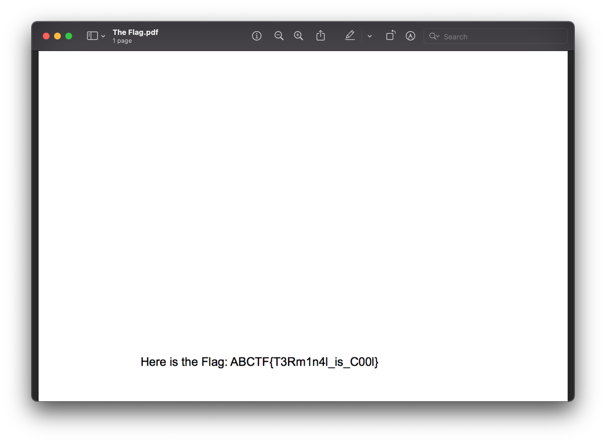

> Just take the Ls. Check out this zip file and I be the flag will remain hidden. https://mega.nz/#!mCgBjZgB!_FtmAm8s_mpsHr7KWv8GYUzhbThNn0I8cHMBi4fJQp8

The link points us to a `.zip` archive to download called `The\ Flag.zip`

Let's start by unzipping it.

```shell
$ unzip The\ Flag.zip
Archive:  The Flag.zip
   creating: The Flag/
  inflating: The Flag/.DS_Store
   creating: __MACOSX/
   creating: __MACOSX/The Flag/
  inflating: __MACOSX/The Flag/._.DS_Store
   creating: The Flag/.ThePassword/
  inflating: The Flag/.ThePassword/ThePassword.txt
  inflating: The Flag/The Flag.pdf
  inflating: __MACOSX/The Flag/._The Flag.pdf
```

> **Note**
> The `__MACOSX` files are used specifically by MacOS, we can ignore it for this challenge.

If we look at the contents, we see a PDF and TXT file with a hidden directory.

```shell
$ ls -al
total 56
drwxr-xr-x@   5 Thomas  staff    160 Oct 30  2016 .
drwx------@ 170 Thomas  staff   5440 Nov  3 19:57 ..
-rw-r--r--@   1 Thomas  staff   6148 Oct 30  2016 .DS_Store
drwxr-xr-x@   3 Thomas  staff     96 Oct 30  2016 .ThePassword
-rw-r--r--@   1 Thomas  staff  16647 Oct 30  2016 The Flag.pdf
```

When we try to open the `The\ Flag.pdf`, we're asked for a password.


Perhaps we'll find the password inside of the hidden `.ThePassword` directory.

```shell
$ ls -al .ThePassword
total 8
drwxr-xr-x@ 3 Thomas  staff   96 Oct 30  2016 .
drwxr-xr-x@ 5 Thomas  staff  160 Oct 30  2016 ..
-rw-r--r--@ 1 Thomas  staff   42 Oct 30  2016 ThePassword.txt
```

Let's take a look at the `ThePassword.txt` file.

```shell
$ cat .ThePassword/ThePassword.txt
Nice Job!  The Password is "Im The Flag".
```

Now we can enter `Im The Flag` into the PDF.


Sure enough, `ABCTF{T3Rm1n4l_is_C00l` is the correct flag.