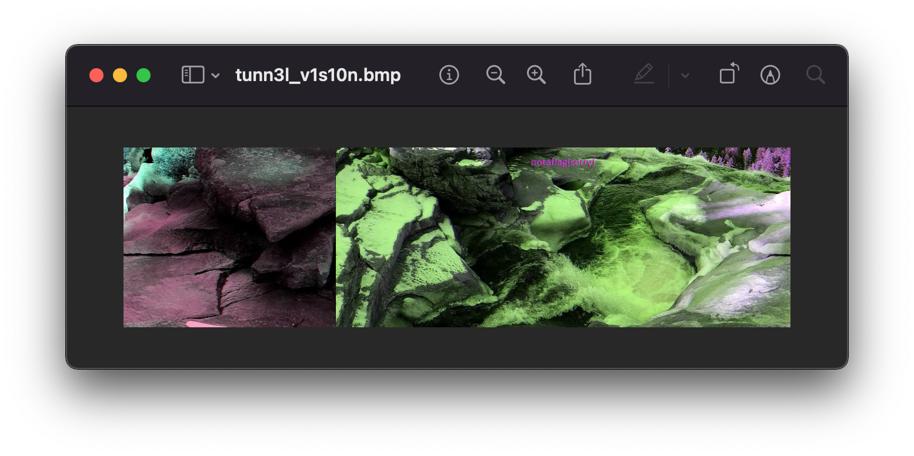
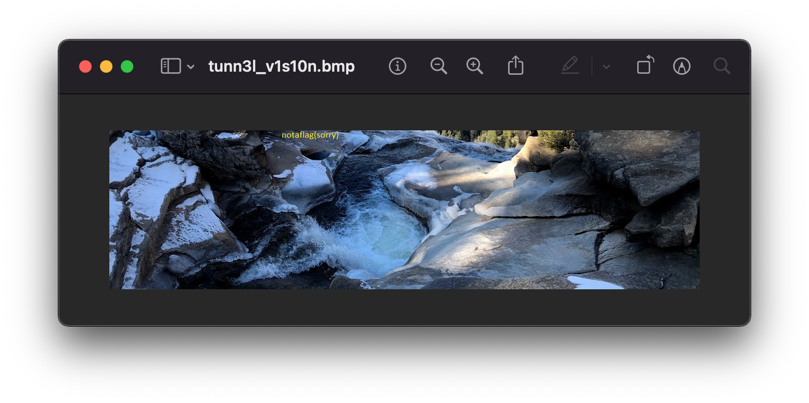
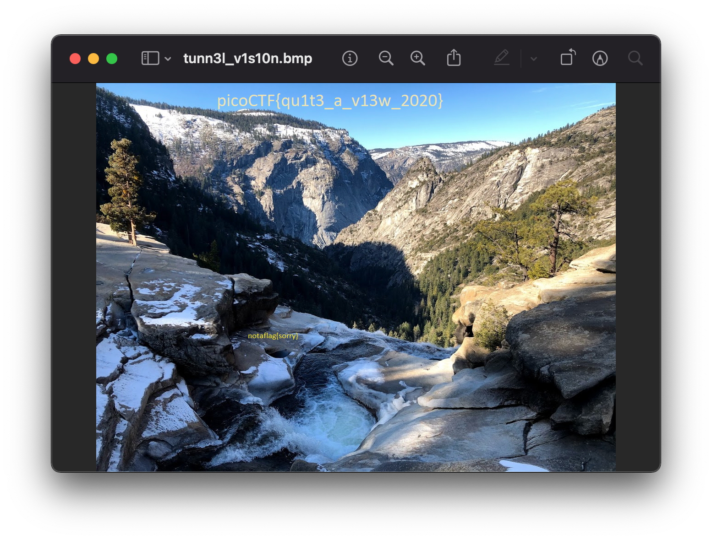

# tunn3l v1s10n

> We found this file. Recover the flag.

Although `file` just outputs "data," if we use hexdump to examine the [magic_bytes](/reference/magic_bytes.md), we can see this might be a `.bmp` file.

```shell
$ hexdump -C tunn3l_v1s10n | head -1
00000000  42 4d 8e 26 2c 00 00 00  00 00 ba d0 00 00 ba d0  |BM.&,...........|
```

We can confirm this by looking at the documentation for BMP files.

> For a BMP file, we look for the byte sequence 42 4D or the ASCII sequence of BM [^1]

This is also apparent when using `exiftool`.

```shell
$ exiftool tunn3l_v1s10n | grep "File Type"
File Type                       : BMP
File Type Extension             : bmp
```

Renaming the file and trying to open it fails.

```shell
$ mv tunn3l_v1s10n tunn3l_v1s10n.bmp
```

There's a clue in the header: two two-byte sequences `bad0`, or "bad". The header needs repairing.

There are more requirements in the docs.

> Byte 1,2 should be [0x4D 0x42]: 424D
>
> Bytes 3-6 (Images Size) 0000073E
>
> Bytes 7,8 (Must be zero) 0000
>
> Bytes 9,10 (Must be zero) 0000
>
> Bytes 11-14 (Image offset) 00000036
>
> Bytes 15-18 (size of BITMAPINFOHEADER structure, must be 40 [0x28]) 00000028
>
> Bytes 19-22 (image width) 00000018
>
> Bytes 23-26 (image height) 00000019
>
> Bytes 27,28 (number of planes in the image, must be 1) 0001
>
> Bytes 29,30 (number of bits per pixel (1, 4, 8, or 24 [0x18])) 0018
>
> -- Note 24 bit color, is three bytes of red, green and blue, each
>
> [^1]

Our "bad"-byte sequence are located at bytes 11-12 and bytes 15-16. If we look at the requirements above, bytes 11-14 represent the image offset, and theoretically that could be 0000d0ba? Bytes 15-18, however, _must_ be 0000002B, but in our case, it's not. Let's look at the next 16 bytes.

```shell
$ hexdump -C tunn3l_v1s10n | head -n 2
00000000  42 4d 8e 26 2c 00 00 00  00 00 ba d0 00 00 ba d0  |BM.&,...........|
00000010  00 00 6e 04 00 00 32 01  00 00 01 00 18 00 00 00  |..n...2.........|
```

Now we can see that bytes 15-18 are 0000d0ab. Let's edit those bytes and see if we can open it.

Using [https://hexed.it/](https://hexed.it/), we can open and edit bytes 15-18, resave the file as `tunn3l_v1s10n.bmp`, and open it.

```shell
$ hexdump tunn3l_v1s10n.bmp | head -n 2
0000000 42 4d 8e 26 2c 00 00 00 00 00 ba d0 00 00 28 00
0000010 00 00 6e 04 00 00 32 01 00 00 01 00 18 00 00 00
```

This works! We can open the file. But sadly, we see `notaflag{sorry}`



> **Note** The colors look a bit off. That's because bytes 11-14, the "image offset," should be the offset from beginning of file to the beginning of the bitmap data. In our case, the bitmap data begins at an offset of 14 + 40 bytes, the header and info header sizes respectively. This would put the offset at 54 bytes or `0x36`. [^2]



Using `exiftool` on the uncorrupted file, we can observe the image resolution and file size discrepancy.

> **Note** In this version of exiftool, we get the File Size in `MiB` (Mebibytes) as default. (This is changed in the [version 12.42](https://exiftool.org/history.html), so instead we can use the `-n` flag to output the File Size in `B` (bytes))

```shell
$ exiftool -n tunn3l_v1s10n.bmp
File Name                       : tunn3l_v1s10n.bmp
File Size                       : 2893454
Bit Depth                       : 24
Image Width                     : 1134
Image Height                    : 306
Image Size                      : 1134x306
```

If the Image Width of `1134` is correct (we're making a big assumption by just looking at the picture, but if we're wrong, we can backtrack and try to modify the width), we can calculate what the hight should be set to.

```ruby
total_bytes = 2893454
header_size = 54 # 14 bytes for the header + 50 bytes for the info header
bytes_per_pixel = 3 # Bit Depth 24 / 8 bits per byte
image_pixel_width = 1134

height = (total_bytes - header_size) / (image_pixel_width * bytes_per_pixel)
#=> 850
```

Knowing that bytes 23-26 in the hexdump specify the image height, we can see that it's set to `0x00000132` or `306` like `exiftool` told us. Let's edit the file to specify `850` or `0x352`, in hex.

```shell
$ hexdump tunn3l_v1s10n.bmp | head -n 2
0000000 4d42 268e 002c 0000 0000 0036 0000 0028
0000010 0000 046e 0000 0352 0000 0001 0018 0000
```




And we have the flag.

```
picoCTF{qu1t3_a_v13w_2020}
```

[^1]: https://asecuritysite.com/forensics/bmp?file=activated.bmp
[^2]: http://www.ece.ualberta.ca/~elliott/ee552/studentAppNotes/2003_w/misc/bmp_file_format/bmp_file_format.htm