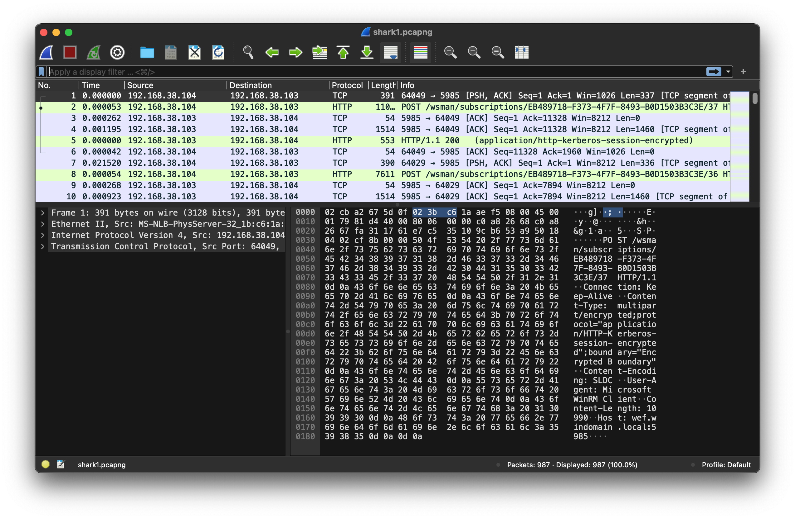
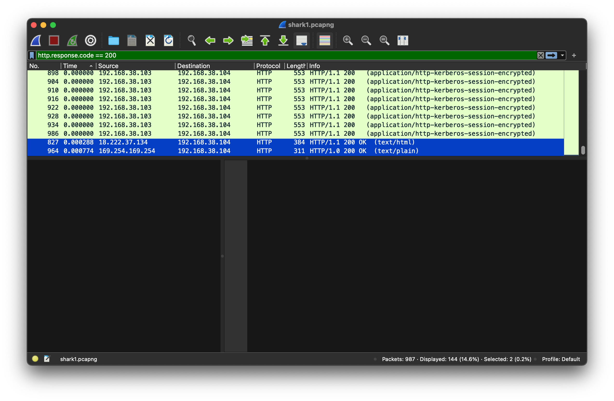
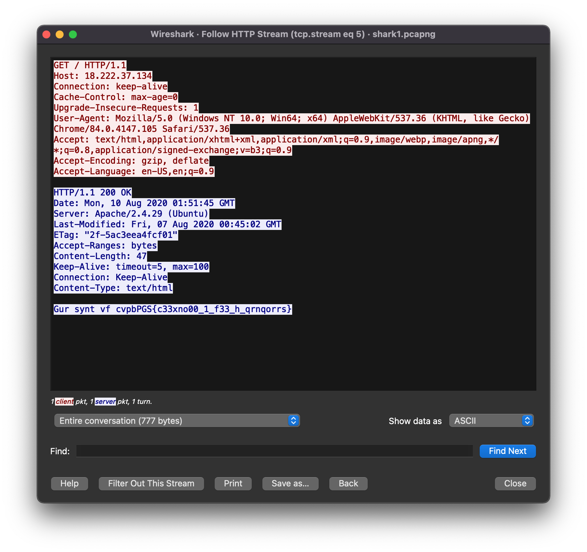

# Wireshark doo dooo do doo...

> Can you find the flag? shark1.pcapng.

PcapNg (the file extension) is a PCAP Next Generation Dump File Format to overcome the limitations of the libpcap format. [source](https://wiki.wireshark.org/Development/PcapNg)

[The top tool for PCAP analysis is Wireshark](https://fareedfauzi.gitbook.io/ctf-checklist-for-beginner/pcap-analysis), and PcapNg can be opened without conversion in Wireshark, too.


There are some [suggested filters](https://book.hacktricks.xyz/generic-methodologies-and-resources/basic-forensic-methodology/pcap-inspection/wireshark-tricks#filters) to use to sift through the streams. Some CTF writeups have suggested to begin HTTP analysis with a `200` filter.

```
http.response.code == 200
```

After doing so, we can see that all but two are `(application/http-kerberos-session-encrypted)`. Apparently, "Kerberos (/ˈkɜːrbərɒs/) is a computer-network authentication protocol that works on the basis of tickets to allow nodes communicating over a non-secure network to prove their identity to one another in a secure manner. Its designers aimed it primarily at a client–server model, and it provides mutual authentication—both the user and the server verify each other's identity." And most importantly: "...Kerberos protocol messages are protected against eavesdropping and replay attacks." [source](https://en.wikipedia.org/wiki/Kerberos_(protocol)).

So ignoring those for now, the other two streams are `(text/html)` and `(text/plain)`.


To view these streams as the application would, we can use Wireshark's [follow](https://www.wireshark.org/docs/wsug_html_chunked/ChAdvFollowStreamSection.html) feature. 

Doing so gives us a more familiar view of the HTTP request and response.


Following the first `(text/html)` stream, we get this view.

The response body contains a _somewhat_ familiar-looking string. Similar to the `picoCTF{flag}` format of the CTF flag.

```
Gur synt vf cvpbPGS{c33xno00_1_f33_h_qrnqorrs}
```

Plugging this into [dcode cypher identifier](https://www.dcode.fr/cipher-identifier), we get a hit for ROT-13.

Sure enough, after decoding, we get the flag.

```
The flag is picoCTF{p33kab00_1_s33_u_deadbeef}
```


