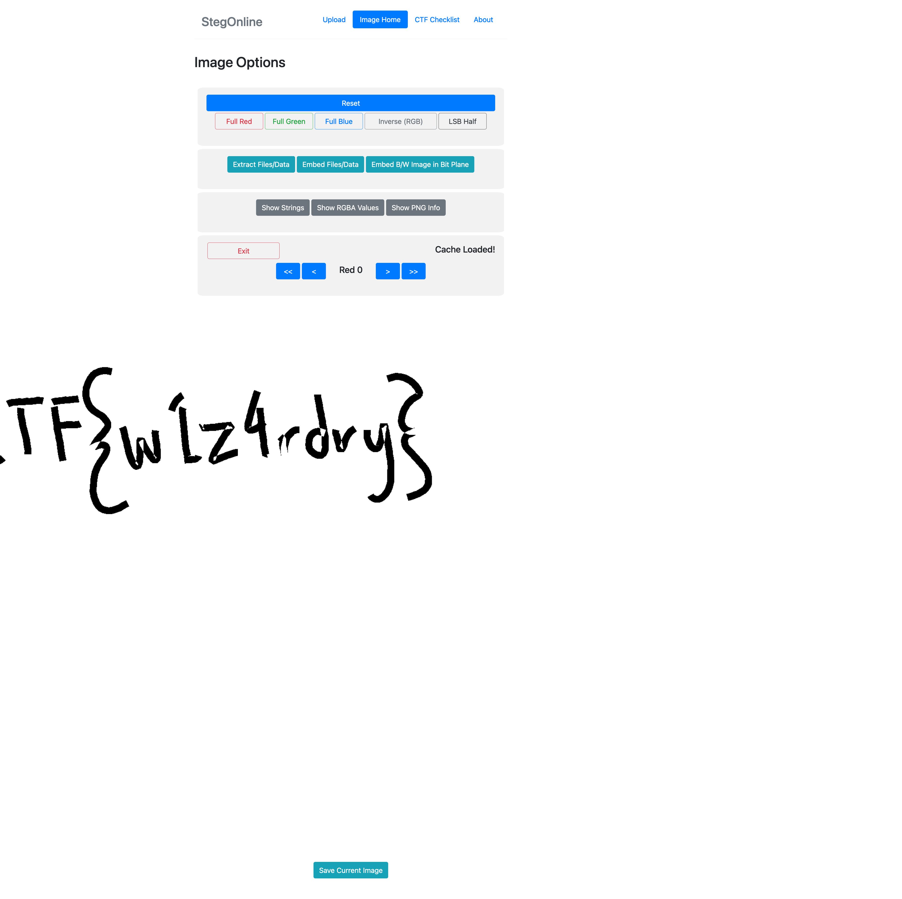

> Ron just found his own copy of advanced potion making, but its been corrupted by some kind of spell. Help him recover it!

The file we're given has no extension and running `file` just reports `data`.

```shell
$ file advanced-potion-making
advanced-potion-making: data
```

If we look at the [magic_bytes](../../reference/magic_bytes.md) in the hexdump, we can see—what appears to be—a corrupted PNG header as evidenced by the `IHDR` (the _image header_ chunk) portion of the first 16 bytes.

```bash
$ hexdump -C -n16 advanced-potion-making
00000000  89 50 42 11 0d 0a 1a 0a  00 12 13 14 49 48 44 52  |.PB.........IHDR|
```

We can see that it's corrupted because the first 8 bytes of a PNG must be `89 50 4e 47 0d 0a 1a 0a`.

> The first byte is used to detect transmission over a 7-bit channel--for example, email transfer programs often strip the 8th bit, thus changing the PNG signature. The 2nd, 3rd, and 4th bytes simply spell ``PNG'' (in ASCII, that is). Bytes 5 and 6 are end-of-line characters for Macintosh and Unix, respectively, and the combination of the two is the standard line ending for DOS, Windows, and OS/2. Byte 7 (CTRL-Z) is the end-of-file character for DOS text files, which allows one to TYPE the PNG file under DOS-like operating systems and see only the acronym ``PNG'' preceded by one strange character, rather than page after page of gobbledygook. Byte 8 is another Unix end-of-line character.[^1]

| Hex Value | Decimal  Value | ASCII Interpretation                                         |
| --------- | -------------- | ------------------------------------------------------------ |
| 89        | 137            | A byte with its most significant bit set ("8-bit character") |
| 50        | 80             | P                                                            |
| 42        | 78             | N                                                            |
| 11        | 71             | G                                                            |
| 0d        | 13             | Carriage-return (CR) character, a.k.a. CTRL-M or ^M          |
| 0a        | 10             | Line-feed (LF) character, a.k.a. CTRL-J or ^J                |
| 1a        | 26             | CTRL-Z or ^Z                                                 |
| 0a        | 10             | Line-feed (LF) character, a.k.a. CTRL-J or ^J                |

Let's fix the header.

```bash
$ hexdump -C -n16 advanced-potion-making.png
00000000  89 50 4e 47 0d 0a 1a 0a  00 00 00 0d 49 48 44 52  |.PNG........IHDR|
```

Now we can open the image.


To the naked eye, this looks to be a solid red image. 

There are a few tool we can use to check to see if this image really _is_ one solid color. Perhaps there's a watermark in a slightly different shade of red.

I'll go over the two different approaches I found that all effectively do the same thing: isolate the different colors within the PNG.

### Analyze the image color using curves.

_Note: I don't know the technical terms for some of these image processing techniques, so please forgive me._

If we squeeze the color range of the image within the narrow band of visible red, we increase the contrast between the red hues in the image. This exposes the flag. This works because the image is comprised of sharp spikes of green, blue, and red, and when analyzing the curves, you can actually see two spikes of red, which indicate there may be more information there.


### Analyze color planes using tools.

A common tools I've seen is `stegsolve`[^2], which is a java-based GUI which allows you to step through different color "bit planes." You can also use the online versions, StegOnline[^3] or aperisolve[^4] , which do much the same thing.


The first bit plan (called `Red 0`) reveals the flag.

> **Note**
> The image is a bit offset in the StegOnline tool. This is either a but with the tool or an issue with the PNG.

A more refined technic is called LSB stenography. 

LSB, or _Least Significant Bit_, stenography is a specific type of color manipulation in which one bit in the color encoding is modified independently.

> LSB stands for Least Significant Bit. Each pixel in a PNG image is generally composed of RGB three primary colors (red, green, and blue), each color occupies 8 bits, and the value range is from '0x00' to '0xFF', so there are 256 colors. The total number of colors is equal to 256 to the third power or 16777216.[^5]

In either case, we can see the `picoCTF{w1z4rdry}` flag hidden in the color information of the PNG.

[^1]: http://www.libpng.org/pub/png/book/chapter08.html#png.ch08.div.2
[^2]: https://github.com/zardus/ctf-tools/blob/master/stegsolve/install
[^3]: https://stegonline.georgeom.net
[^4]: https://www.aperisolve.com
[^5]: https://ctf-wiki.mahaloz.re/misc/picture/png/#lsb