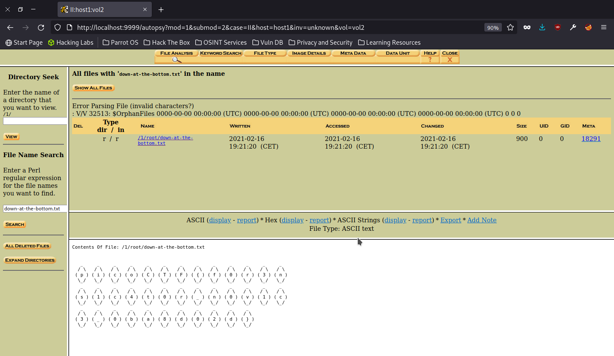

> All we know is the file with the flag is named `down-at-the-bottom.txt`... Disk image: dds2-alpine.flag.img.gz

Decompress then image file.

```shell
$ gzip -d dds2-alpine.flag.img.gz
```

Open it in autopsy by first creating a new case and host and providing the path to the image. 

Analyze the `/1/` disk and navigate to the "File Analysis" page where you can search for the `down-at-the-bottom.txt` file.



The flag is revealed as ASCII art in the file contents.

```
Contents Of File: /1/root/down-at-the-bottom.txt


   _     _     _     _     _     _     _     _     _     _     _     _     _  
  / \   / \   / \   / \   / \   / \   / \   / \   / \   / \   / \   / \   / \ 
 ( p ) ( i ) ( c ) ( o ) ( C ) ( T ) ( F ) ( { ) ( f ) ( 0 ) ( r ) ( 3 ) ( n )
  \_/   \_/   \_/   \_/   \_/   \_/   \_/   \_/   \_/   \_/   \_/   \_/   \_/ 
   _     _     _     _     _     _     _     _     _     _     _     _     _  
  / \   / \   / \   / \   / \   / \   / \   / \   / \   / \   / \   / \   / \ 
 ( s ) ( 1 ) ( c ) ( 4 ) ( t ) ( 0 ) ( r ) ( _ ) ( n ) ( 0 ) ( v ) ( 1 ) ( c )
  \_/   \_/   \_/   \_/   \_/   \_/   \_/   \_/   \_/   \_/   \_/   \_/   \_/ 
   _     _     _     _     _     _     _     _     _     _     _  
  / \   / \   / \   / \   / \   / \   / \   / \   / \   / \   / \ 
 ( 3 ) ( _ ) ( 0 ) ( b ) ( a ) ( 8 ) ( d ) ( 0 ) ( 2 ) ( d ) ( } )
  \_/   \_/   \_/   \_/   \_/   \_/   \_/   \_/   \_/   \_/   \_/
```

