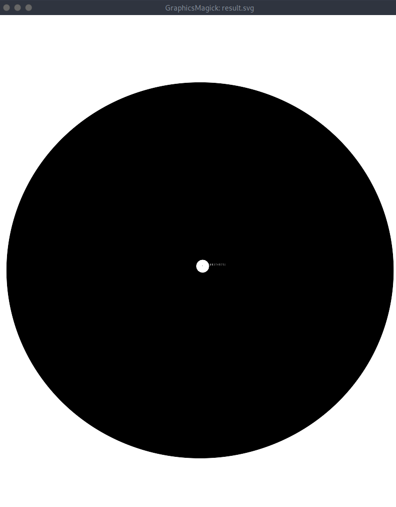

> Download this image file and find the flag.

When we open the image, we can see—what appears to be—some text.



SVGs, Scalable Vector Graphics, are defined by a series of instructions in XML. These instructions define a series of vectors such that they can "scale" infinitely. As such, my initial instinct was to find an SVG editor that would allow me to scale this image.

That didn't work with `display`, so I tried to take a look at the XML itself and that's when I saw the flag.

Open up the SVG file in a text editor to reveal the flag as a `text` SVG element or use grep to find the related `tspan`-s.

```shell
grep "tspan*" drawing.flag.svg 
       id="text3723"><tspan
         id="tspan3748">p </tspan><tspan
         id="tspan3754">i </tspan><tspan
         id="tspan3756">c </tspan><tspan
         id="tspan3758">o </tspan><tspan
         id="tspan3760">C </tspan><tspan
         id="tspan3762">T </tspan><tspan
         id="tspan3764">F { 3 n h 4 n </tspan><tspan
         id="tspan3752">c 3 d _ 2 4 3 7 4 6 7 5 }</tspan></text>
```

The flag is `picoCTF{3nh4nc3d_24374675}`