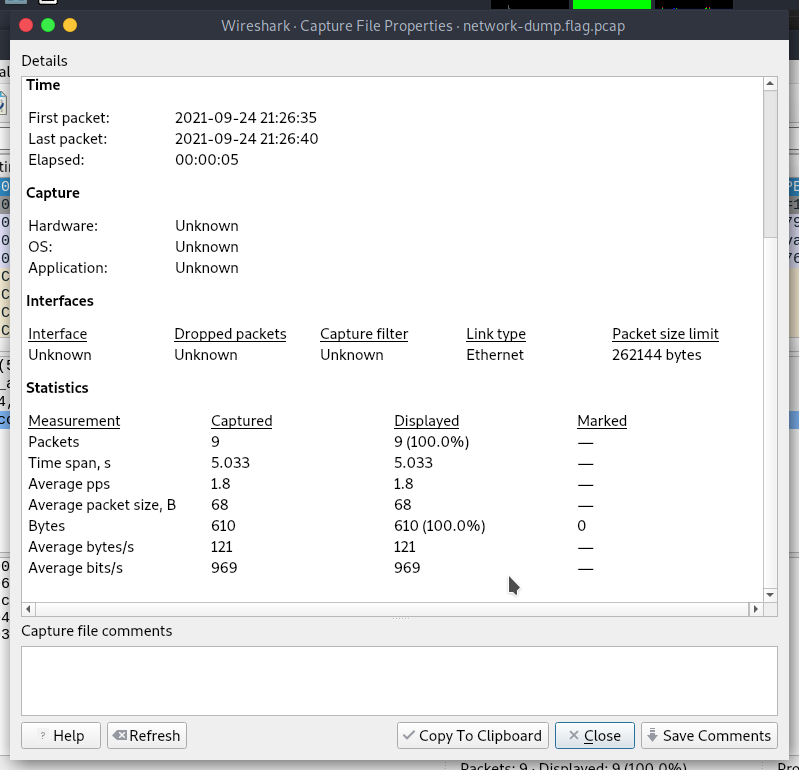
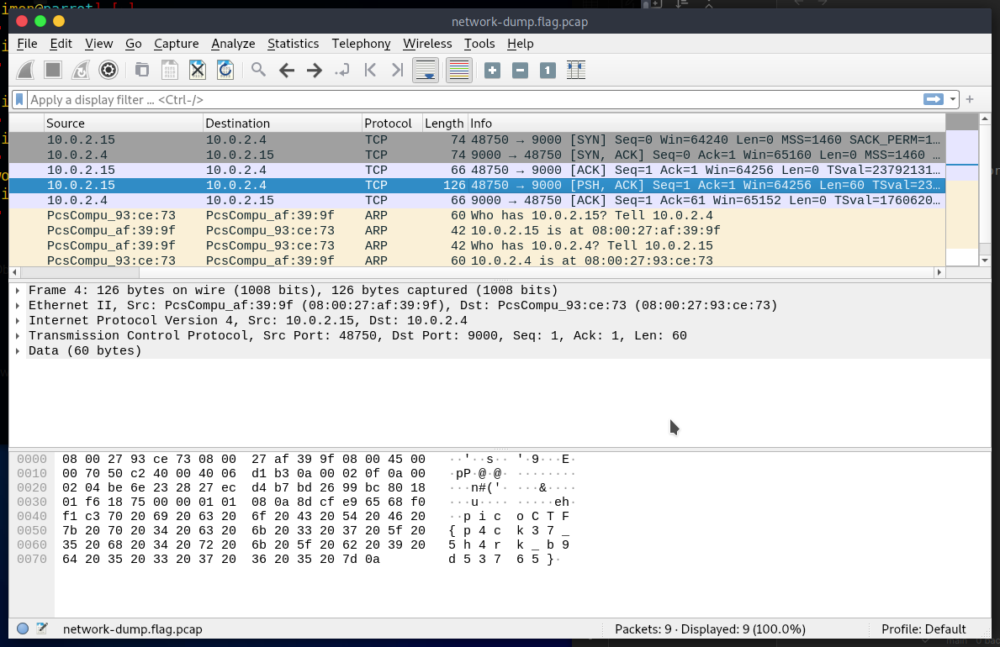

> Download the packet capture file and use packet analysis software to find the flag.

The `.pcap` file only has nine packets in it.

We can manually scan them and find the flag within the data of a TCP packet.

