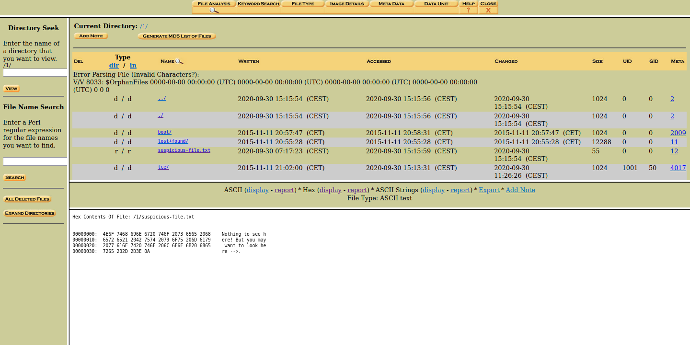
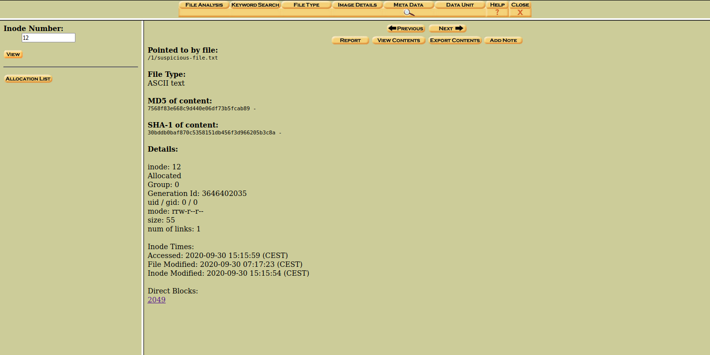
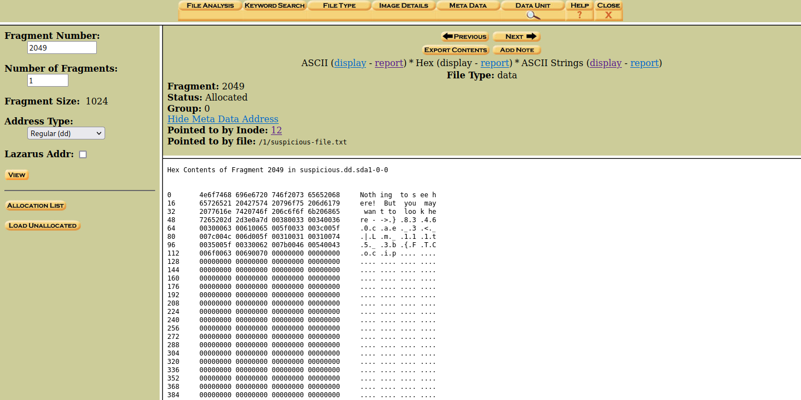

> 'Suspicious' is written all over this disk image. Download suspicious.dd.sda1

Let's see what kind of file `suspicious.dd.sda1` is.

```shell
$ file suspicious.dd.sda1
suspicious.dd.sda1: Linux rev 1.0 ext3 filesystem data, UUID=fc168af0-183b-4e53-bdf3-9c1055413b40 (needs journal recovery)
```

Here, we have an ext3 filesystem image.

> **Note** `(needs journal recovery)` indicates that this filesystem was not unmounted properly.

We can run `fls` to get an overview of the files and directories within the filesystem.

```shell
$ fls suspicious.dd.sda1 
d/d 11:	lost+found
d/d 2009:	boot
d/d 4017:	tce
r/r 12:	suspicious-file.txt
V/V 8033:	$OrphanFiles
```

> **Note** You can run `fls` with the `--recursive` option to recurse through the directories, in this case it wasn't yet necessary.

Immediately, we see the `suspicious-file.txt`. 

Let's see what's inside using `icat`.

```
$icat suspicious.dd.sda1 12
Nothing to see here! But you may want to look here -->
```

The `-->` characters seem to be pointing to something, but nothing seems to be there—the file is empty after that line. 

We can open the image in autopsy to see if, perhaps, there's some binary data that isn't being rendered in ASCII.



```hexdump
00000000:  4E6F 7468 696E 6720 746F 2073 6565 2068    Nothing to see h
00000010:  6572 6521 2042 7574 2079 6F75 206D 6179    ere! But you may
00000020:  2077 616E 7420 746F 206C 6F6F 6B20 6865     want to look he
00000030:  7265 202D 2D3E 0A                          re -->.
```

Unfortunately, there's doesn't seem to be anything else in the file.

Before we proceed, it might be helpful to better understand Extended File systems. Here is an except about ext2 filesystems. In this challenge, the differences between ext2 and ext3 aren't applicable.

> The EXT2 file system, like a lot of the file systems, is built on the premise that the data held in files is kept in data blocks. These data blocks are all of the same length and, although that length can vary between different EXT2 file systems the block size of a particular EXT2 file system is set when it is created (using mke2fs). 
> 
> Every file's size is rounded up to an integral number of blocks. If the block size is 1024 bytes, then a file of 1025 bytes will occupy two 1024 byte blocks. Unfortunately this means that on average you waste half a block per file... 
> 
> Not all of the blocks in the file system hold data, some must be used to contain the information that describes the structure of the file system. EXT2 defines the file system topology by describing each file in the system with an inode data structure. An inode describes which blocks the data within a file occupies as well as the access rights of the file, the file's modification times and the type of the file. 
> 
> Every file in the EXT2 file system is described by a single inode and each inode has a single unique number identifying it. The inodes for the file system are all kept together in inode tables. EXT2 directories are simply special files (themselves described by inodes) which contain pointers to the inodes of their directory entries. [^1]

To summarize, the disk is divided into equally-sized blocks. A file is allocated across full (not necessarily sequential) blocks, even if the file doesn't take up the entire space. Which blocks a given file takes up is recorded in an inode. There is one inode per file.

When viewing the file structure of an image in Autopsy, we can see a "META" column which links to the inode for the given file. 

> **Meta Data**: The file name structures contain a pointer to the meta data structure that describes the file. This column contains the address of the structure. Selecting this value will display the details in the bottom window. [^2]

For `suspicious.file.txt`, we see the number `12`. 

When we visit that link, we see the analysis page for inode 12.



Here, we can see the metadata contained within that inode. This includes the name of the file, the file type, etc.

Additionally, at the bottom of that page, there's a link under "Direct Blocks." These links to blocks, or _file allocation units_, of the partition on the physical media that the filesystem occupies. 

For inode `12`, the only block is `2049`. 

Following that link brings us to the block, or _fragment_, analysis page.



Here, can see the flag in reverse character order.

```
Hex Contents of Fragment 2049 in suspicious.dd.sda1-0-0


0	 4e6f7468 696e6720 746f2073 65652068 	Noth ing  to s ee h 
16	 65726521 20427574 20796f75 206d6179 	ere!  But  you  may 
32	 2077616e 7420746f 206c6f6f 6b206865 	 wan t to  loo k he 
48	 7265202d 2d3e0a7d 00380033 00340036 	re - ->.} .8.3 .4.6 
64	 00300063 00610065 005f0033 003c005f 	.0.c .a.e ._.3 .<._ 
80	 007c004c 006d005f 00310031 00310074 	.|.L .m._ .1.1 .1.t 
96	 0035005f 00330062 007b0046 00540043 	.5._ .3.b .{.F .T.C 
112	 006f0063 00690070 00000000 00000000 	.o.c .i.p .... .... 
128	 00000000 00000000 00000000 00000000 	.... .... .... .... 
144	 00000000 00000000 00000000 00000000 	.... .... .... .... 
160	 00000000 00000000 00000000 00000000 	.... .... .... .... 
...
976	 00000000 00000000 00000000 00000000 	.... .... .... .... 
992	 00000000 00000000 00000000 00000000 	.... .... .... .... 
1008 00000000 00000000 00000000 00000000 	.... .... .... ....
```

We can reverse the flag and remove the NULL-bytes , rendered in ASCII as end-stops (`.`), by using `sed` and `rev`.

```shell
$ echo "}.8.3.4.6.0.c.a.e._.3.<._.|.L.m._.1.1.1.t.5._.3.b.{.F.T.C.o.c.i.p" | sed 's/\.//g' | rev
picoCTF{b3_5t111_mL|_<3_eac06438}
```


Why does this data show up in the block of `1024` bytes, but not the file itself? Ext3 allocated these bytes to this file and created an inode to point to it, but for whatever reason, nothing after byte `54` seems to show up.

Before we answer that, let's remember why this block has 1024 bytes in the first place when the data takes up so little space?

> Even if a file requires less space than the file allocation unit size, an entire file allocation unit is still reserved for the file. For example, if the file allocation unit size is 32 kilobytes (KB) and a file is only 7 KB, the entire 32 KB is still allocated to the file, but only 7 KB is used, resulting in 25 KB of unused space. This unused space is referred to as file slack space, and it may hold residual data such as portions of deleted files. [^3]

To understand _why_ filesystems accept slack space as a tradeoff is a topic outside of the scope of this writeup, but with this knowledge, we can understand why there's more space allocated to this block than is needed for the data.

If the filesystem doesn't consider the extra space as part of the file, i.e. the "slack space," then it won't be made addressable by the filesystem on read and that data won't show up via the tools and text editors we're used to. That's why we must view the space on disk directly.

Back to our first question, how did data end up in the slack space in such a way that the inode only considers `55` byes as part of the file? 

tl;dr Tools like `bmap` do exactly that.[^4]

I'm not 100% certain, but my assumption is that `bmap` will find slack space in blocks by looking at the disk directly and considering which bytes are not considered as part of the file by the inode in order to write data there.

In the wide, this technique can be used to store data in filesystems that we don't have write privileges to.

> File slack space is more likely to be used by people who don't have the permission to write files on the system, such as hackers. For example, hackers could use the technique to store small Perl scripts or lists of cracked passwords.[^4]


[^1]: https://tldp.org/LDP/tlk/fs/filesystem.html
[^2]: http://www.sleuthkit.org/autopsy/help/file_mode.html
[^3]: https://nvlpubs.nist.gov/nistpubs/Legacy/SP/nistspecialpublication800-86.pdf
[^4]: https://www.giac.org/paper/gsec/3133/introduction-hiding-finding-data-linux/105105 