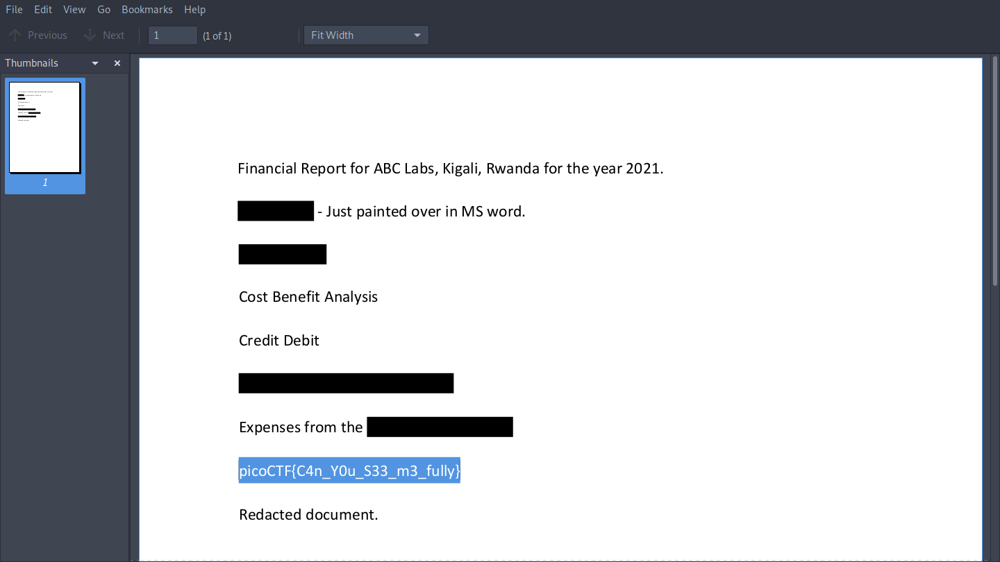

> Now you DON’T see me. This report has some critical data in it, some of which have been redacted correctly, while some were not. Can you find an important key that was not redacted properly?

Open the PDF and select the redacted text to reveal the flag.

