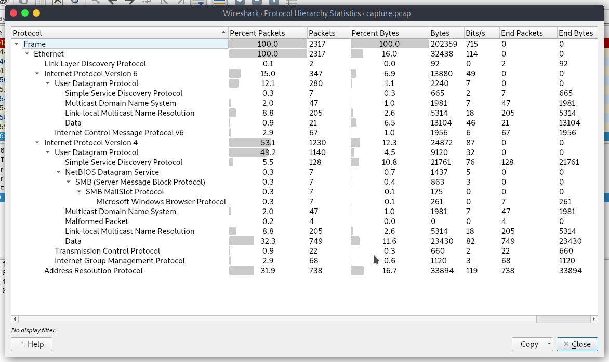
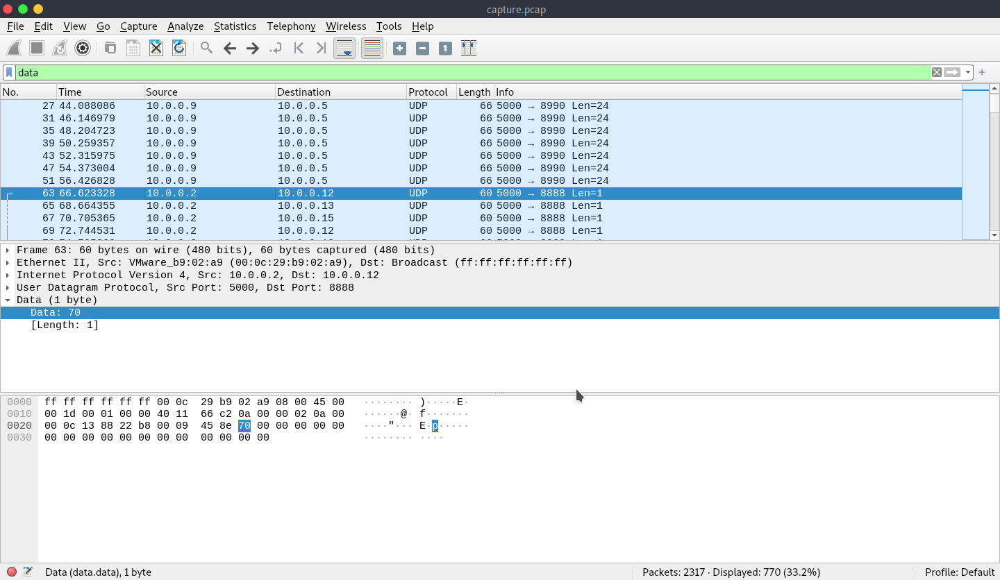
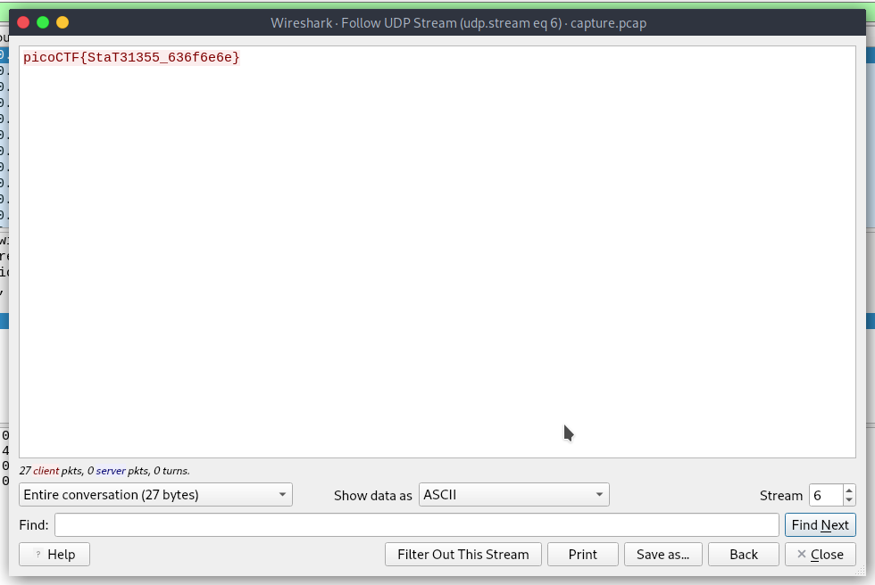

Opening up the `.pcap` file in Wireshark, the first thing we can do is have a look at the Protocol Hierarchy, which tells us the proportion of each protocol that shows up in the capture.

At 32.3%, UDP Data packets are the majority. This is also interesting because these data packets will be in cleartext.

If we filter the capture by `data` (which is what happened when I "Right Click->Apply as Filter->Selected" in the Protocol Hierarchy window, but we could just as easily filter by `udp` manually), we see a series packets that appear to be a recurring pattern of 24 bytes, followed by a series of packets of one byte.

When we take a look at the first one byte packet, we see a `p`.

If we follow this UDP stream (Right Click->Follow->UDP Stream), we get the flag.

